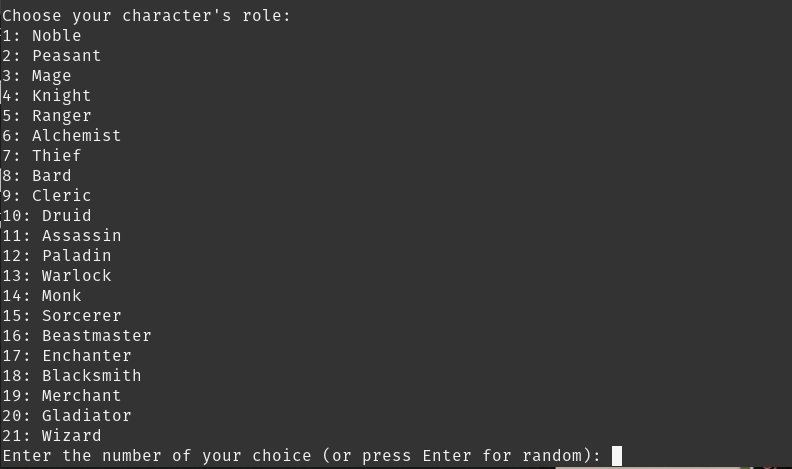
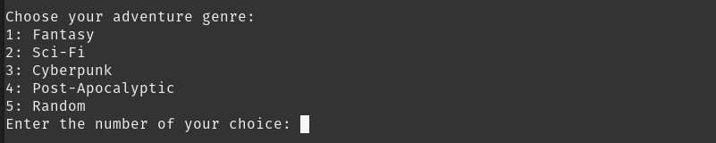

# 🤖 Open Source AI Tool: Dungeo AI

## 🌟 What Is This Project?

**Dungeo AI** is a free and open-source AI Dungeon-style text adventure with optional [AllTalk TTS](https://github.com/erew123/alltalk_tts) narrator support.

Created with ❤️ for all ages—build your own interactive story with AI!

> 🛑 **Notice**: This software is free for **personal and educational use only**.  
> If you use this project **commercially** or integrate it into any **monetized** or **restricted** system,  
> **YOU MUST CREDIT THE ORIGINAL AUTHOR.**

---

## ⚙️ Requirements

- 🐍 Python `3.10+`
- 📦 `pip` (Python package installer)
- 🦙 [Ollama](https://ollama.com/) for LLM inference
- 🧠 NVIDIA GPU with [CUDA Toolkit](https://developer.nvidia.com/cuda-toolkit) for performance (optional but recommended)
- 🧰 `git` (optional, for cloning)
- 🎤 [AllTalk TTS](https://github.com/erew123/alltalk_tts) for voice narration (optional)

---

## 📦 Installation

### 1️⃣ Clone the Repository

```bash
git clone https://github.com/Laszlobeer/Dungeo_ai.git
cd Dungeo_ai
```

### 2A️ Create Virtual Environment

```bash
python -m venv Dungeo_ai
source Dungeo_ai/bin/activate  # On Windows: Dungeo_ai\Scripts\activate
```

### 2B️ (Alternative) Create Conda Environment

```bash
conda create -n dungeo_ai python=3.10 -y
conda activate dungeo_ai
```

### 3️⃣ Install Dependencies

```bash
pip install -r requirements.txt
```

> 💡 If you encounter issues with `requirements.txt`, install manually:

```bash
pip install torch transformers flask
```

---

## 🚀 Usage

  
  
  


### 🧪 Basic Example

```bash
python main.py
```

---

## 💬 Available Commands

```bash
/? or /help       - Show help message  
/censored         - Toggle NSFW/SFW mode (uses banwords.txt)  
/redo             - Regenerate last AI response  
/save             - Save current adventure to adventure.txt  
/load             - Load adventure from adventure.txt  
/change           - Switch Ollama model  
/exit             - Exit the game  
```

---

## 📜 License & Credits

🆓 **MIT License**

You are free to use, modify, and distribute this software.  
However, if you:
- Use it **commercially**
- Include it in a **monetized app**
- **Fork it publicly** with major modifications

👉 You **must** give credit to the original author!

### ✍️ Example Credit

```
This project is based on Open Source AI Tool by Laszlo  
https://github.com/Laszlobeer/Dungeo_ai
```

---

🙏 Thanks for supporting open source! 🫶
